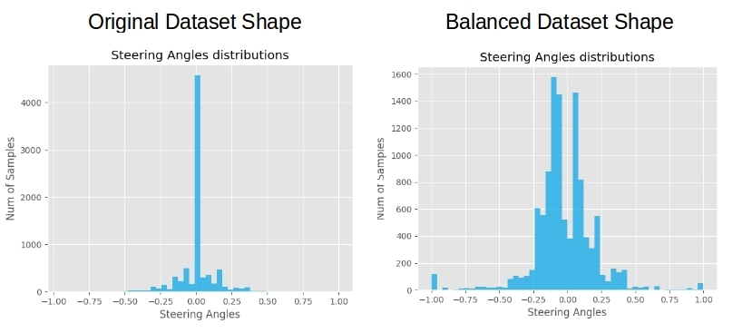
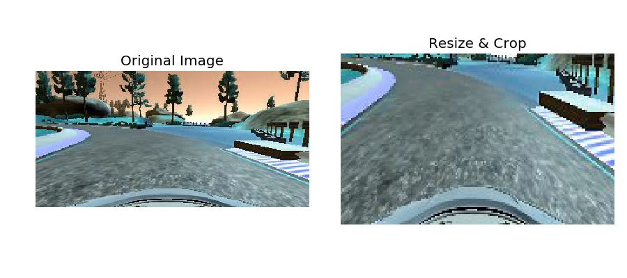

# Behavioral Cloning - Project

The goals / steps of this project are the following:

 - Use the simulator to collect data of good driving behavior
 - Build, a convolution neural network in Keras that predicts steering angles from images
 - Train and validate the model with a training and validation set
 - Test that the model successfully drives around track one without leaving the road
 - Summarize the results with a written report


## Data Collection:
In order to train the neural network designed to drive the car around the circuit, Udacity has deployed an awesome Simulator.


This tool allows users to drive the car on a circuit and record the images generated.

For this project the sample data provided by Udacity plus some data generated by myself are used to generate the sets of images used to train the neural network.

## Convolutional Neural Network:
My model architecture is based on that of Nvidia in their [end-to-end](http://images.nvidia.com/content/tegra/automotive/images/2016/solutions/pdf/end-to-end-dl-using-px.pdf) paper.
The differences are as follows: I did the normalization outside of the CNN with an explicit function, and rather than using multi-pixel strides during convolution, I used max pooling layers after the convolution.  It’s not clear if the authors used dropout, but as many references (blogposts above, Confluence posts, etc) cautioned about overfitting in this project, I included dropout after every layer.

For the last layer I chose ```tanh``` for my activation layer, to ensure I could get results between -1 and +1.  For all other layers I chose ```relu```.

|Layer (type)                     |Output Shape          |Param #     |Connected to               |
|:--------------------------------|:---------------------|:-----------|:--------------------------|
|convolution2d_1 (Convolution2D)  |(None, 49, 99, 24)    |1176        |convolution2d_input_1[0][0]|
|convolution2d_2 (Convolution2D)  |(None, 23, 48, 36)    |13860       |convolution2d_1[0][0]      |
|convolution2d_3 (Convolution2D)  |(None, 10, 23, 48)    |27696       |convolution2d_2[0][0]      |
|convolution2d_4 (Convolution2D)  |(None, 8, 21, 64)     |27712       |convolution2d_3[0][0]      |
|flatten_1 (Flatten)              |(None, 10752)         |0           |convolution2d_4[0][0]      |
|dense_1 (Dense)                  |(None, 100)           |1075300     |flatten_1[0][0]            |
|dropout_1 (Dropout)              |(None, 100)           |0           |dense_1[0][0]              |
|dense_2 (Dense)                  |(None, 64)            |6464        |dropout_1[0][0]            |
|dense_3 (Dense)                  |(None, 10)            |650         |dense_2[0][0]              |
|dense_4 (Dense)                  |(None, 1)             |11          |dense_3[0][0]              |
Total params: 1,152,869
Trainable params: 1,152,869
Non-trainable params: 0
____________________________________________________________________________________________________

## Pre-processing and Training
The dataset generated has shape: ```(18838, 100, 160, 3)```, that is, includes 18838 images (or frames) where each image has width and height 160 and 100 pixels respectively as well as 3 different channels corresponding to the color space ```RGB```. Of course, the dataset includes just pictures generated from right drives, we don't want to make the model learn from erratic drives!.
Also, since the dataset is significantly unbalanced, when driving most steering angles are zero or close to zero!, 70% of the images with ```steering angle <= 0.05``` are removed from the original dataset. As a result, a more balanced dataset is used:



All images are rescaled to the mentioned width and height, also, part of the image is cropped. The reason to resize the image to a lower scale is to reduce the computational cost during training and predicting and the reason for cropping the section of the image above the road segment is to reduce the amount of useless information passed to the network. The function ```process_images()``` is employed for this purpose:



Next step is to generate augmented data, as usual, main benefit of using augmented data when training a neural network is to increase the number of samples during training, reduce overfitting and boost the model's performance when dealing with unseen data.
Brightness, random shadows and random flipping are the transformations used to generate the augmented data. Function ```augmented_images()``` performs the operation:


For training, the dataset is divided into training and validation sets, with an 80/20 split.  I didn’t explicitly make a test dataset, as the real test is whether the car is able to drive around the track in the simulator. To generate the augmented data to be used to train the neural network it is used the function: ```generator()```, the main advantage of this generator is to generate images "on-the-fly" to avoid the need of creating and **storing** all these examples.

## Model Results:
In this [Youtube Video](https://youtu.be/gM-k6z8_30Y) is presented an example of fully autonomous drive! :movie_camera::blue_car::computer:

## Reflections

While it seems feasible to train a car to drive in this way, there are important limitations that need to be handled.  For instance, obstacle avoidance is not even discussed here.  Another example is understanding road conditions: wet, icy, sandy, etc.  Another important factor is driving during night conditions, this would be like training over a completely different dataset.
